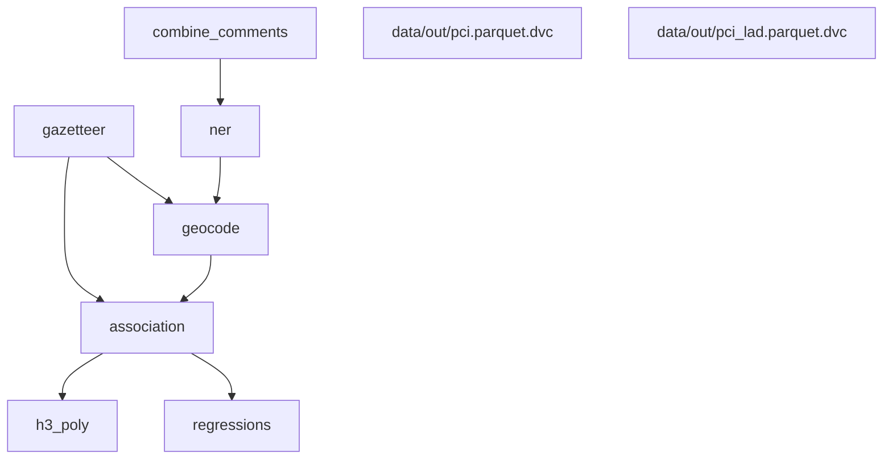

<div align="center">

# Mapping Cognitive Place Associations within the United Kingdom through Online Discussion on Reddit

<a href="https://www.python.org"></a>
<a href="https://pytorch.org/"></a>
<a href="https://pytorchlightning.ai/"></a>

</div>

<!--
<p align="center">
<a href="https://cjber.github.io/georelations/src">Documentation</a> •
<a href="todo">FigShare (soon)</a>
</p>
-->

[Cillian Berragan](https://www.liverpool.ac.uk/geographic-data-science/our-people/) \[[`@cjberragan`](http://twitter.com/cjberragan)\]<sup>1\*</sup>,
[Alex Singleton](https://www.liverpool.ac.uk/geographic-data-science/our-people/) \[[`@alexsingleton`](https://twitter.com/alexsingleton)\]<sup>1</sup>,
[Alessia Calafiore](https://www.eca.ed.ac.uk/profile/dr-alessia-calafiore) \[[`@alel_domi`](http://twitter.com/alel_domi)\]<sup>2</sup> &
Jeremy Morley \[[`@jeremy_morley`](http://twitter.com/meremy_morley)\]<sup>3</sup>

<sup>1</sup> _Geographic Data Science Lab, University of Liverpool, Liverpool, United Kingdom_  
<sup>2</sup> _Edinburgh College of Art, University of Edinburgh, United Kingdom_  
<sup>3</sup> _Ordnance Survey, Southampton, United Kingdom_

<sup>\*</sup>_Correspondence_: c.berragan@liverpool.ac.uk

## Abstract

This paper explores cognitive place associations; conceptualised as a place-based mental model that derives subconscious links between geographic locations. Utilising a large corpus of online discussion data from the social media website Reddit, we experiment on the extraction of such geographic knowledge from unstructured text. First we construct a system to identify place names found in Reddit comments, disambiguating each to a set of coordinates where possible. Following this, we build a collective picture of cognitive place associations in the United Kingdom, linking locations that co-occur in user comments and evaluating the effect of distance on the strength of these associations. Exploring these geographies nationally, associations were shown to be typically weaker over greater distances. This distance decay is also highly regional, rural areas typically have greater levels of distance decay, particularly in Wales and Scotland. When comparing major cities across the UK, we observe distinct distance decay patterns, influenced primarily by proximity to other cities.

## HuggingFace NER Model

The NER model used as part of this work is available on the [HuggingFace model hub](https://huggingface.co/cjber/reddit-ner-place_names). Instructions for using this model are included on the model card. For more information relating to model training please see the model [GitHub repository](https://github.com/cjber/reddit-model).

### Project layout

```bash
scripts
├── analysis
│   ├── pci.py  # functions to create associations
│   ├── process.py  # combines all analysis
│   └── regressions.py  # regression analysis
└── preprocessing
    ├── gazetteer.py  # combine os open names and gbpn
    ├── ner.py  # run NER model over all Reddit comments
    ├── geocode.py  # geocode all identified place names
    ├── combine_comments.py  # combine comments
    ├── h3_poly.py  # create h3 polygon for UK
    └── reddit_api.py  # query reddit api
```

### DVC pipeline

```yaml
stages:
  gazetteer:
    cmd: python -m scripts.preprocessing.gazetteer
    deps:
    - scripts/preprocessing/gazetteer.py

    - ${DATA_DIR}/lad-2021.gpkg
    - ${DATA_DIR}/gbpn-2021_14_06.csv
    - ${DATA_DIR}/os_opname-2023_02_21
    outs:
      - data/processed/gazetteer.parquet
    frozen: false
  combine_comments:
    cmd: python -m scripts.preprocessing.combine_comments
    deps:
      - scripts/preprocessing/combine_comments.py

      - ${DATA_DIR}/comments-2022_04_17
    outs:
      - data/processed/comments.parquet
    frozen: false
  ner:
    cmd: python -m scripts.preprocessing.ner
    deps:
      - scripts/preprocessing/ner.py

      - data/processed/comments.parquet
    outs:
      - data/processed/ner.csv:
          push: false
    frozen: true
  geocode:
    cmd: python -m scripts.preprocessing.geocode
    deps:
      - scripts/preprocessing/geocode.py

      - data/processed/ner.csv
      - data/processed/gazetteer.parquet
      - ${DATA_DIR}/subreddits-2023_02_21.parquet
    outs:
      - data/processed/geocoded.csv:
          push: false
    frozen: true
  association:
    cmd: python -m scripts.analysis.process
    deps:
      - scripts/analysis/process.py
      - scripts/analysis/pci.py

      - data/processed/geocoded.csv
      - data/processed/gazetteer.parquet
    outs:
      - data/out/places_full.parquet
      - data/out/places.parquet
      - data/out/pci_h3.parquet
    frozen: false
  regressions:
    cmd: python -m scripts.analysis.regressions
    deps:
      - scripts/analysis/regressions.py

      - data/out/pci_h3.parquet
    outs:
      - data/out/regressions/lr_metrics.json
      - data/out/regressions/lr.parquet
      - data/out/regressions/mm.parquet
      - data/out/regressions/mm_random_effects.parquet
      - data/out/regressions/mm_metrics.json
    frozen: false
  h3_poly:
    cmd: python -m scripts.preprocessing.h3_poly
    deps:
      - scripts/preprocessing/h3_poly.py

      - data/out/places.parquet
```

### DVC dag


